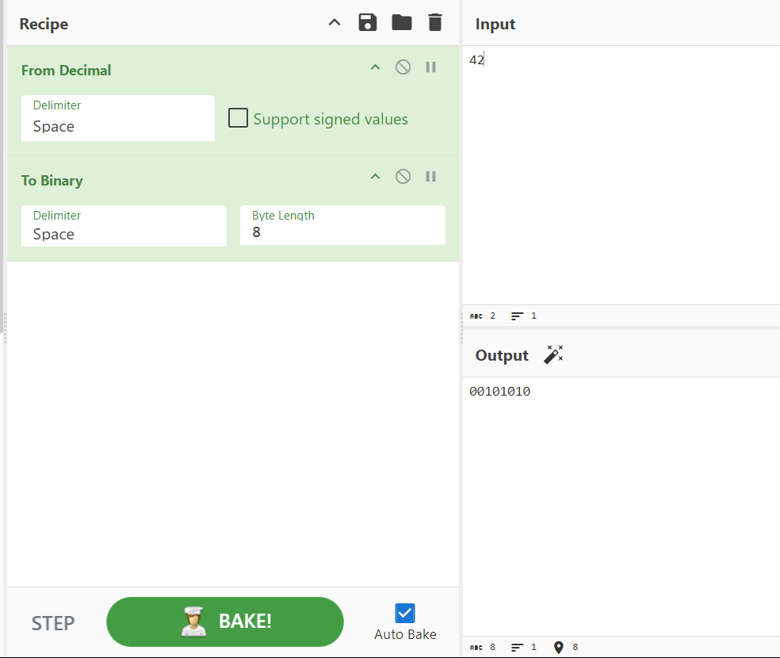

# [picoCTF 2019] - 2Warm

## Category: Cryptography

## Difficulty: Easy

##  Description: Can you convert the number 42 (base 10) to binary (base 2)?

## Hints
> Submit your answer in our competition's flag format. For example, if your answer was '11111', you would submit 'picoCTF{11111}' as the flag.

## Soltion
- Like [Mod_26](Mod_26.md) we also use [Cyberchef](https://gchq.github.io/CyberChef/)

## Flag
> picoCTF{101010}

## Conclusion
Learn how to use Cyberchef