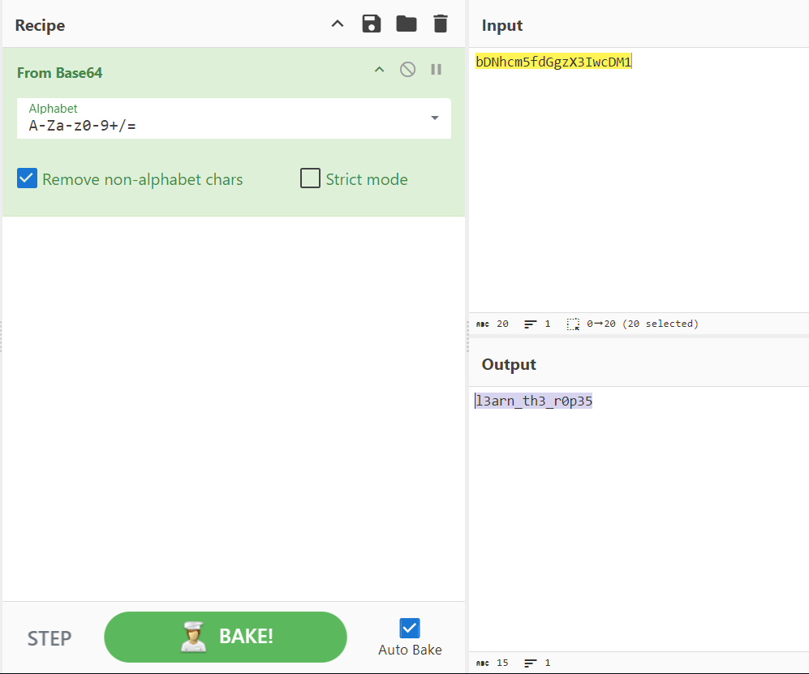

# [picoCTF 2019] - Bases

## Category: General skills

## Difficulty: Easy

##  Description: What does this bDNhcm5fdGgzX3IwcDM1 mean? I think it has something to do with bases.

## Hints
> Submit your answer in our flag format. For example, if your answer was 'hello', you would submit 'picoCTF{hello}' as the flag.

## Soltion
- Like [Mod_26](Mod_26.md) we also use [Cyberchef](https://gchq.github.io/CyberChef/)

## Flag
> picoCTF{l3arn_th3_r0p35}

## Conclusion
Learn how to use Cyberchef