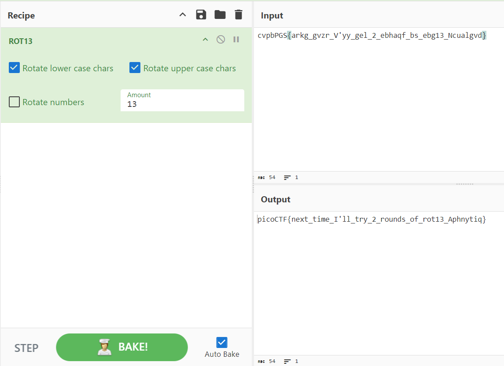

# [picoCTF 2021] - Mod 26

## Category: Cryptography

## Difficulty: Easy

##  Description: Cryptography can be easy, do you know what ROT13 is? `cvpbPGS{arkg_gvzr_V'yy_gel_2_ebhaqf_bs_ebg13_Ncualgvd}`

## Hints:
> This can be solved online if you don't want to do it by hand!

## Solution

### Step 1: What is rot13 and how to determine?
- ROT13 is a simple substitution cipher used to encode text. It stands for "rotate by 13 places," and it is a special case of the Caesar cipher, where the alphabet is shifted by 13 places.
- Determine:
  - Characters: ROT13 only changes alphabetic characters and leaves other characters such as numbers and punctuation intact.
  - Natural reflexes: Sounds a bit funny, but when we do many exercises, we will form reflexes.

### Step 2: Use tool to decrypt
- Tool: [Cyberchef](https://gchq.github.io/CyberChef/)

## Flag
> picoCTF{next_time_I'll_try_2_rounds_of_rot13_Aphnytiq}

## Conclusion
To decode the given ROT13 cipher, we used an online tool designed for such cryptographic tasks. ROT13 is a substitution cipher that rotates letters by 13 places in the alphabet, making it a straightforward method for encoding and decoding messages. Using the [Cyberchef tool](https://gchq.github.io/CyberChef/), we successfully decrypted the cipher text to reveal the flag: