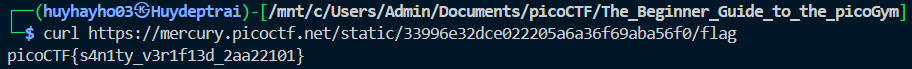

# [picoCTF 2021] - Obedient cat

## Category: General skills

## Difficulty: Easy

##  Description
> This file has a flag in plain sight (aka "in-the-clear"). [Download flag](https://mercury.picoctf.net/static/33996e32dce022205a6a36f69aba56f0/flag).

## Hints:
> 1. Any hints about entering a command into the Terminal (such as the next one), will start with a '$'... everything after the dollar sign will be typed (or copy and pasted) into your Terminal.
> 2. To get the file accessible in your shell, enter the following in the Terminal prompt: $ wget https://mercury.picoctf.net/static/33996e32dce022205a6a36f69aba56f0/flag
> 3. $ man cat

## Solution

### Step 1: Analyzing the link
- We can use `wget` to download the file. Alternatively, we can use `curl` and the contents of the file will be displayed directly to the terminal.
  - `wget https://mercury.picoctf.net/static/33996e32dce022205a6a36f69aba56f0/flag`
  - `curl https://mercury.picoctf.net/static/33996e32dce022205a6a36f69aba56f0/flag`
### Step 2: View result
- Use `cat` to read file if we use `wget`
- Read directly in terminal if we use `curl`

### Flag
> picoCTF{s4n1ty_v3r1f13d_2aa22101}

### Conclusion
In this challenge, we demonstrated the importance of using basic terminal commands to retrieve and inspect files. By leveraging either wget to download the file and cat to view its contents, or using curl to directly display the contents of the file in the terminal, we were able to easily retrieve the flag. This challenge reinforces the concept that sometimes, the information you need is in plain sight and just requires the appropriate command to access it. Understanding how to use basic file manipulation tools is essential in both CTF challenges and real-world scenarios.
