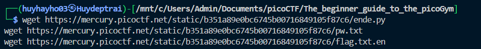

# [picoCTF 2021] - Python Wrangling

## Category: General skills

## Difficulty: Easy

##  Description: Python scripts are invoked kind of like programs in the Terminal... Can you run [this Python script](https://mercury.picoctf.net/static/b351a89e0bc6745b00716849105f87c6/ende.py) using [this password](https://mercury.picoctf.net/static/b351a89e0bc6745b00716849105f87c6/pw.txt) to get the [flag](https://mercury.picoctf.net/static/b351a89e0bc6745b00716849105f87c6/flag.txt.en)?

## Hints
> 1. Get the Python script accessible in your shell by entering the following command in the Terminal prompt: `$ wget https://mercury.picoctf.net/static/b351a89e0bc6745b00716849105f87c6/ende.py`
> 2. $ man python

## Soltion

### Step 1: Download the Python script and file
- You used `wget` to download the Python script (`ende.py`), password file (`pw.txt`), and encrypted flag file (`flag.txt.en`).

    

- The script `ende.py` likely performs encryption or decryption. We need to use the password from `pw.txt` to decrypt the file `flag.txt.en`.

### Step 2: Run the script
- Use the python3 command to run the script with the appropriate options for decryption: `python3 ende.py -d flag.txt.en`

## Flag
> picoCTF{4p0110_1n_7h3_h0us3_67c6cc96}

## Conclusion
1. Download the required files: Use wget to download the Python script (ende.py), password file (pw.txt), and encrypted flag file (flag.txt.en).

2. Run the Python script for decryption: Use the command python3 ende.py -d flag.txt.en to decrypt the file flag.txt.en with the password from pw.txt.