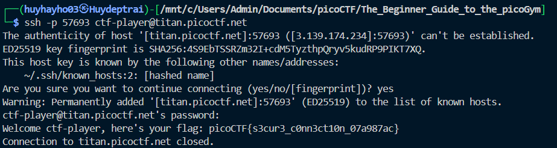

# [picoCTF 2024] - Super SSH

## Category: General skills

## Difficulty: Easy 

## Descripton
> Using a Secure Shell (SSH) is going to be pretty important. Additional details will be available after launching your challenge instance.
> 
> Can you `ssh` as `ctf-player` to `titan.picoctf.net` at port `57693` to get the flag?
> 
> You'll also need the password `84b12bae`. If asked, accept the fingerprint with `yes`.
> 
> If your device doesn't have a shell, you can use: [https://webshell.picoctf.org](https://webshell.picoctf.org/)
> 
> If you're not sure what a shell is, check out our Primer: [https://primer.picoctf.com/#_the_shell](https://primer.picoctf.com/#_the_shell)

## Hints
> 1. [https://linux.die.net/man/1/ssh](https://linux.die.net/man/1/ssh)
> 2. You can try logging in 'as' someone with `<user>`@titan.picoctf.net
> 3. How could you specify the port?
> 4. Remember, passwords are hidden when typed into the shell

## Soulution

### Step 1: Connect to the server
- Launch instace
- Connect `ssh` to `titan.picoctf.net` with user name is `ctf-player` at port `57693`
  - Command: `ssh -p 57693 ctf-player@titan.picoctf.net`
- Accept figerprint
- Press password: `84b12bae`

### Step 2: Find flag
- Read content in directly file

## Flag
> picoCTF{s3cur3_c0nn3ct10n_07a987ac}

## Conclusion
By connecting to the SSH server using the provided credentials and port, and entering the correct password, you can easily retrieve the flag which will be displayed in the terminal upon login. Make sure to handle the SSH fingerprint correctly and keep in mind that the password input will be hidden.
