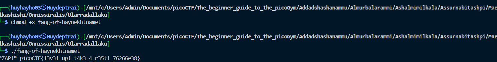

# [picoCTF 2021] - Tab, tab attack 

## Category: General skills

## Difficulty: Easy

##  Description: Using tabcomplete in the Terminal will add years to your life, esp. when dealing with long rambling directory structures and filenames: [Addadshashanammu.zip](https://mercury.picoctf.net/static/fe16c756149cfa85f23e73cd9dbd6a25/Addadshashanammu.zip)

## Hints
> After `unzip`ing, this problem can be solved with 11 button-presses...(mostly Tab)...

## Soltion

### Step 1: Analyzing file
- Unzip file and we can see the last file in the series of files displayed after unzip
- Use tab to move in the last file
- check information of file and we have ELF file

### Step 2: Run file
- Complie file: `chmod +x fang-of-haynekhtnamet` 
- Run: `./fang-of-haynekhtnamet`

## Flag
> picoCTF{l3v3l_up!_t4k3_4_r35t!_76266e38}

## Conclusion
This challenge highlights the efficiency of using tab completion in the Terminal to navigate complex directory structures and filenames. By unzipping the file and using tab completion to identify and execute the ELF file, you can reveal the flag. The key steps involve unzipping, using tab to navigate, and running the file to obtain the flag. 