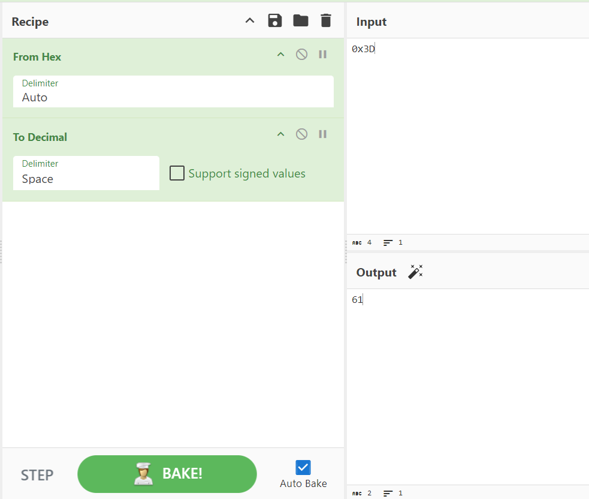

# [picoCTF 2019] - Warmed Up

## Category: Cryptography

## Difficulty: Easy

##  Description: What is 0x3D (base 16) in decimal (base 10)?

## Hints
> Submit your answer in our flag format. For example, if your answer was '22', you would submit 'picoCTF{22}' as the flag.

## Soltion
- Like [Mod_26](Mod_26.md) we also use [Cyberchef](https://gchq.github.io/CyberChef/)

## Flag
> picoCTF{61}

## Conclusion
Learn how to use Cyberchef