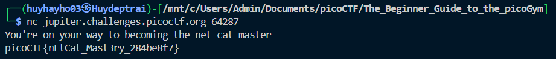

# [picoCTF 2019] - what's a net cat?

## Category: General skills

## Difficulty: Easy

## Descriptop: Using netcat (nc) is going to be pretty important. Can you connect to `jupiter.challenges.picoctf.org` at port `64287` to get the flag?

## Hints:
> nc [tutorial](https://linux.die.net/man/1/nc)

## Solution

### Step 1: Connect to the server
- Using command `nc` to connect to `jupiter.challenges.picoctf.org` at port `64287`
  - Command: `nc jupiter.challenges.picoctf.org 64287`
### Step 2: Find flag
- Read file to find flag

## Flag
> picoCTF{nEtCat_Mast3ry_284be8f7}

## Conclusion
In this challenge, we used netcat (nc) to connect to a specified server and port. By connecting to jupiter.challenges.picoctf.org on port 64287, we were able to retrieve and view the flag. The successful use of netcat demonstrates its utility for network communication and troubleshooting.