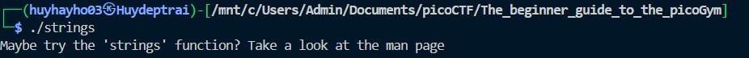

# [picoCTF 2019] - string it

## Category: General skills

## Difficulty: Easy

##  Description: Can you find the flag in [file](https://jupiter.challenges.picoctf.org/static/5bd86036f013ac3b9c958499adf3e2e2/strings) without running it?

## Hints
> [strings](https://linux.die.net/man/1/strings)

## Soltion

### Step 1: Analyzing file 
- After download file, we need to know what is type of file by using `file`
- Try `./strings`

- We receive 1 notification try use `strings` function

### Step 2: 
- Use `strings strings | grep 'picoCTF` to decrypt and find flag

## Flag
> picoCTF{5tRIng5_1T_827aee91}

## Conclusion
To find the flag in this challenge, you simply need to use the `strings` command on the provided file to extract readable text. Once you have the output, search through it to locate the flag.