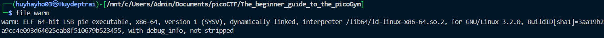
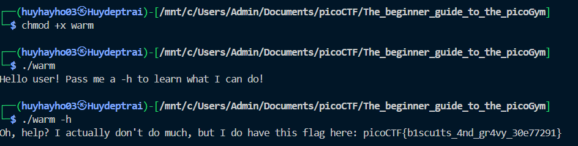

# [picoCTF 2021] - Wave a flag

## Category: General skills

## Difficulty: Easy

##  Description: Can you invoke help flags for a tool or binary? [This program](https://mercury.picoctf.net/static/cfea736820f329083dab9558c3932ada/warm) has extraordinarily helpful information...

## Hints
> 1. This program will only work in the webshell or another Linux computer.
> 
> 2. To get the file accessible in your shell, enter the following in the Terminal prompt: `$ wget https://mercury.picoctf.net/static/cfea736820f329083dab9558c3932ada/warm`
>
> 3. Run this program by entering the following in the Terminal prompt: `$ ./warm`, but you'll first have to make it executable with `$ chmod +x warm`
>
> 4. -h and --help are the most common arguments to give to programs to get more information from them!
>
> 5. Not every program implements help features like -h and --help.

## Soltion

### Step 1: Analyzing file
- After download file, we need check information of that file
  - Command: `file warm`
  

### Step 2: Run file
- This is ELF file, so we can compile and run that file
  - Command: `chmod +x warm` --> `./warm`
- Now we see the content suggest use `./warm -h` to continue

  
## Flag
> picoCTF{b1scu1ts_4nd_gr4vy_30e77291}

## Conclusion
This challenge demonstrated the importance of help flags (-h or --help) in command-line utilities. By utilizing them, we can discover useful information about how a program works or identify required parameters. In this case, we used basic Linux commands to analyze and execute a binary file, successfully retrieving the flag. Understanding how to work with file permissions (chmod) and command-line arguments is crucial when interacting with executables in CTF challenges.